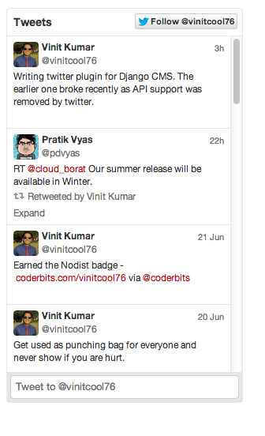

##About

[](https://crate.io/package/cmsplugin-twitter)

Twitter recently dropped support for v1.0 of its REST API. Since this was used in DjangoCMS, all of the installations which used this plugin broke.
Hence, this is an attempt to create a similar plugin using widgets.


##Installation

- In order to install this plugin, fire up your virtualenv:

	```bash
		pip install cmsplugin-twitter
	```

- And add the this line in INSTALLED_APPS in your base.py
```python
INSTALLED_APPS = (
    'south',
    'project.apps.movies',
    'project.apps.books',
    'project.apps.blog',
    'project.apps.linkedin',

    'django.contrib.auth',
    'django.contrib.contenttypes',
    'django.contrib.sessions',
    'django.contrib.sites',
    'django.contrib.messages',
    'django.contrib.staticfiles',

    'cms',
    'cms.plugins.text',
    'cms.plugins.picture',
    'cms.plugins.link',
    'cms.plugins.file',
    'cms.plugins.snippet',
    'cms.plugins.googlemap',
    'sekizai',
    'cmsplugin_twitter',
    'menus',
    'mptt',
    'publisher',
    'storages',
    'boto',
    'tinymce', 
)
```
considering you have settings.py similar to this:

```python
import os
import imp
import socket
import subprocess


WEBAPP_ROOT = os.path.dirname(os.path.realpath(__file__))

def get_environment_file_path(env):
    return os.path.join(WEBAPP_ROOT, 'config', '%s.py' % env)

config = imp.load_source('base_settings', get_environment_file_path('base'))
from base_settings import *


if 'APP_ENV' in os.environ:
    ENV = os.environ['APP_ENV']
else:
    ENV = 'local'

try:
    config = imp.load_source('env_settings', get_environment_file_path(ENV))
    from env_settings import *
except IOError:
    exit("No configuration file found for env '%s'" % ENV)
```

- After saving them , run:

	```bash
		python manage.py syncdb
		python manage.py migrate
	```

##How to Use:

- Login to your `twitter` account and go to this url: `https://twitter.com/settings/widgets`

- Create a new widgets and then copy the `twitter handle ` and ` widget_id` from the generated script.

- Enter those two fields in the plugin form and other fields and you are good to go.


##Plugin in Action


This is the plugin working on a Django-CMS site:




Enjoy!

[](https://bitdeli.com/free "Bitdeli Badge")


